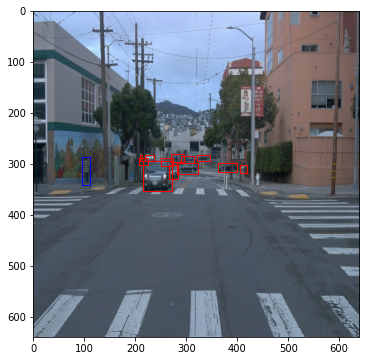
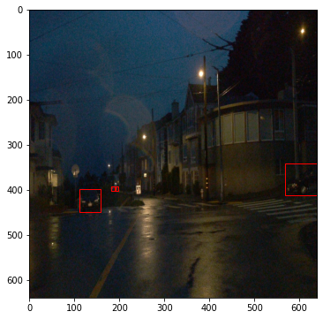
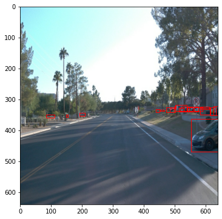
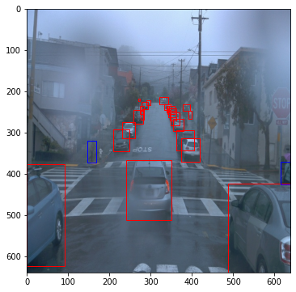
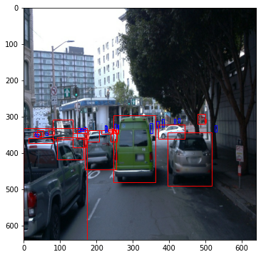
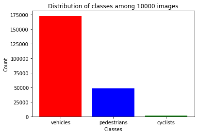
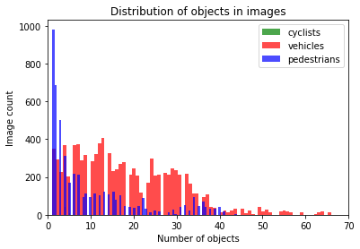
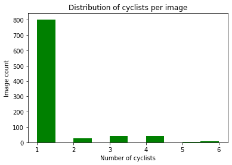

# Object Detection in an Urban Environment

## Data

For this project, we will be using data from the [Waymo Open dataset](https://waymo.com/open/).

[OPTIONAL] - The files can be downloaded directly from the website as tar files or from the [Google Cloud Bucket](https://console.cloud.google.com/storage/browser/waymo_open_dataset_v_1_2_0_individual_files/) as individual tf records. We have already provided the data required to finish this project in the workspace, so you don't need to download it separately.

## Structure
The structure of the repository is as follows:
```
	- Images - this folder consists of images from EDA, histograms, augmented images and the tensorboard images
    - experiments - this folder contains the initial and final models as two experiments. A reference folder with the pretrained model(checkpoint), the changed pipeline file, the model file, the labels file and the exported model
    - edit_config.py
    - Exploratory Data Analysis Notebook.ipynb
    - Data augmentation Notebook.ipynb
    - filenames.txt 
    - label_map.pbtxt - a mapping file for the objects
    - inference_video.py - for creating the animation
    - launch_python.sh - link for jupyter notebook
    - pipeline.config - pipeline configuration file
    - utils.py - contains a set of useful functions
```
### Data

The data in the workspace that will be used for training, validation and testing is organized as follow:
```
/home/workspace/data/waymo
	- training_and_validation - contains 97 files to train and validate your models
    - train: contain the train data (empty to start)
    - val: contain the val data (empty to start)
    - test - contains 3 files to test your model and create inference videos
```
The `training_and_validation` folder contains file that have been downsampled: we have selected one every 10 frames from 10 fps videos. The `testing` folder contains frames from the 10 fps video without downsampling.
```
Since the project workspace was used this split data was already available.


Experiments
The experiments folder will be organized as follow:

experiments/
    - pretrained_model/
    - exporter_main_v2.py - to create an inference model
    - model_main_tf2.py - to launch training
    - reference/ - reference training with the changed config file
    - experiment0/ - contains the pipeline config file for the reference model. If this is used to execute the program the reference model and results will be obtained. 
    - experiment1/ - create a new folder for each experiment you run. This folder contains the pipeline_new config file for the new experiment.
    - label_map.pbtxt
```
#### Note : Event files contained inside the train, val folders are not included in the upload. The same applies for the checkpoints. These can be generated by running the code
## Prerequisites

#### Local Setup - Not applicable since the remote workspace was used (please ignore this section)

For local setup check the GitHub repository - (https://github.com/udacity/nd013-c1-vision-starter)

### Classroom Workspace

In the classroom workspace, every library and package is already installed in the  environment. In addition to this, necessary train, validation and test splits are already made. Details on splitting the data is also available in the reference Github repository (see above)
## Instructions

### Exploratory Data Analysis

The data already present in `/home/workspace/data/train/` directory is used to explore the dataset! 


### Edit the config file

Now you are ready for training. As we explain during the course, the Tf Object Detection API relies on **config files**. The config that we will use for this project is `pipeline.config`, which is the config for a SSD Resnet 50 640x640 model. You can learn more about the Single Shot Detector [here](https://arxiv.org/pdf/1512.02325.pdf).

First, let's download the [pretrained model](http://download.tensorflow.org/models/object_detection/tf2/20200711/ssd_resnet50_v1_fpn_640x640_coco17_tpu-8.tar.gz) and move it to `/home/workspace/experiments/pretrained_model/`.

We need to edit the config files to change the location of the training and validation files, as well as the location of the label_map file, pretrained weights. We also need to adjust the batch size. To do so, run the following:
```
python edit_config.py --train_dir /home/workspace/data/train/ --eval_dir /home/workspace/data/val/ --batch_size 2 --checkpoint /home/workspace/experiments/pretrained_model/ssd_resnet50_v1_fpn_640x640_coco17_tpu-8/checkpoint/ckpt-0 --label_map /home/workspace/experiments/label_map.pbtxt
```
A new config file has been created, `pipeline_new.config`.

### Training

You will now launch your very first experiment with the Tensorflow object detection API. Move the `pipeline_new.config` to the `/home/workspace/experiments/reference` folder. Now launch the training process:
* a training process:
```
python experiments/model_main_tf2.py --model_dir=experiments/reference/ --pipeline_config_path=experiments/reference/pipeline_new.config
```
Once the training is finished, launch the evaluation process:
* an evaluation process:
```
python experiments/model_main_tf2.py --model_dir=experiments/reference/ --pipeline_config_path=experiments/reference/pipeline_new.config --checkpoint_dir=experiments/reference/
```

**Note**: Both processes will display some Tensorflow warnings, which can be ignored. You may have to kill the evaluation script manually using
`CTRL+C`.

To monitor the training, you can launch a tensorboard instance by running `python -m tensorboard.main --logdir experiments/reference/`. You will report your findings in the writeup.

### Improve the performances

Most likely, this initial experiment did not yield optimal results. However, you can make multiple changes to the config file to improve this model. One obvious change consists in improving the data augmentation strategy. The [`preprocessor.proto`](https://github.com/tensorflow/models/blob/master/research/object_detection/protos/preprocessor.proto) file contains the different data augmentation method available in the Tf Object Detection API. To help you visualize these augmentations, we are providing a notebook: `Explore augmentations.ipynb`. Using this notebook, try different data augmentation combinations and select the one you think is optimal for our dataset. Justify your choices in the writeup.

Keep in mind that the following are also available:
* experiment with the optimizer: type of optimizer, learning rate, scheduler etc
* experiment with the architecture. The Tf Object Detection API [model zoo](https://github.com/tensorflow/models/blob/master/research/object_detection/g3doc/tf2_detection_zoo.md) offers many architectures. Keep in mind that the `pipeline.config` file is unique for each architecture and you will have to edit it.

**Important:** If you are working on the workspace, your storage is limited. You may to delete the checkpoints files after each experiment. You should however keep the `tf.events` files located in the `train` and `eval` folder of your experiments. You can also keep the `saved_model` folder to create your videos.


### Creating an animation
#### Export the trained model
Modify the arguments of the following function to adjust it to your models:

```
python experiments/exporter_main_v2.py --input_type image_tensor --pipeline_config_path experiments/reference/pipeline_new.config --trained_checkpoint_dir experiments/reference/ --output_directory experiments/reference/exported/
```

This should create a new folder `experiments/reference/exported/saved_model`. You can read more about the Tensorflow SavedModel format [here](https://www.tensorflow.org/guide/saved_model).

Finally, you can create a video of your model's inferences for any tf record file. To do so, run the following command (modify it to your files):
```
python inference_video.py --labelmap_path label_map.pbtxt --model_path experiments/reference/exported/saved_model --tf_record_path /data/waymo/testing/segment-12200383401366682847_2552_140_2572_140_with_camera_labels.tfrecord --config_path experiments/reference/pipeline_new.config --output_path animation.gif
```

## Submission Template

### Project overview
This section should contain a brief description of the project and what we are trying to achieve. Why is object detection such an important component of self driving car systems?

### Set up
This section should contain a brief description of the steps to follow to run the code for this repository. Set up and how to run the repository is discussed in the above sections.

### Dataset
#### Dataset analysis
This section should contain a quantitative and qualitative description of the dataset. It should include images, charts and other visualizations.
An exploratory data analysis is performed and this is presented as a jupyter notebook where a function to display images is implemented. The images obtained from this function are:

  |  
  |  
  |  

The reference figures are shown in the Images folder:
From the analysed images it is clear that there are clear images as well as images that would require necessary data augmentations. For example this includes images at night, images under fog and rain.
Due to this there are effects like blurring, lack of brightness and contrast etc. Also it could be seen that some of the objects lie more towrds the edges than the center (see image 3) In addition, three plots were made to understand the distribution of classes and the count of object. This analysis would help us to identify whether the data is skewed. A skewed data could impact the accuracy of the model.

First a distribution of classes among 10000 images is explored. This gives an idea about the class distribution and is represented by the below histogram.



From this it is clear that images containing the cyclist class is very less compared to the other two classes, meaning that the data is skewed. This is further explored by plotting the distribution of the three objects in the images. 



Here also the distribution of pedestrians and vehicles are prominent while the cyclists are more or less invisible. It is also worth noting that the proportion of cars to pedestrians is also high (i.e there is a high number of single or <10 pedestrians per image compared to the count of vehicles per image). Considering the fact that cars are larger objects and when the images with a higher proportion of pedestrians is not high, this could indicate a lower accuracy for pedestrian prediction in comparison to that for vehicles. Since the cyclists presence in this chart is not easily identifiable a separate plot for cyclist distribution is made.



From the above distribution it is clear that the presence of cyclists in the provided images is far and few and even when present it is a single cyclist.

To conclude, it can be seen that there are images with objects at the edges, images in the dark, in rain and under foggy conditions. Applying augmentation methods should be able to rectify this to an extend.
Also there are only few images of cyclists indicating a skewed dataset and since the proportion of vehicles is higher than that for pedestrians a better accuracy for vehicles in comparison to both pedestrians and cyclists is to be expected.
### Training

#### Reference experiment
Following the instructions first an initial reference model is downloaded and a Resnet model is applied. The pipeline configuration corresponding to this model is provided in the *experiments/experiment0* folder. 
The metrics used include, Precision and Recall. The results of the initial model are presented below.


After around 2500 steps the loss remained around 2.8 with very low precision and recall values. The loss curve is also indicative of a higher learning rate which explains the higher loss. Due to this the bounding boxes were not detected.

#### Improve on the reference

After this and based on the EDA the following data augmentations were applied:
1. Random horizontal flip - already present
2. Random adjust brightness 
3. Random adjust contrast
4. Random adjust Hue
5. Random adjust saturation
6. Random rgb to grey

Since the learning rate was found to be high, this has been lowered to 0.001 from 0.004 and the warmup learning rate is also decreased to 1e-4. Also the number of steps has been increased from the default 2500 to 5000. Since this might be a higher number of steps that actually required, the training would truncate at 4000 steps. The results of the new experiment are as follows:


Due to the lower learning rate the loss has been able to be decreased to around 1 and this has impacted the precision as well as recall values. The learning rate also follows the expected cosine curve. This resulted in an improved model with the bounding boxes able to detect correctly as showning the below .gif.(The file is compressed to reduce size and this has decreased the quality of the animation)

This has also resulted in an improved accuracy in detection varying between 30 -65 %.


The animation is made from images in a challenging environment. Some of the vehicles coming in the opposite direction were not detected. This could be explored in the next version.
#### Conclusion and Suggestions

The object detection application has been successfully implemented and a short .gif file showing the object detection is developed. It has an accuracy ranging from 30-65%. There is definitely scope for improvements.

1. More images with cyclists and larger number of pedestrians will better the proportion of cyclists in the distribution and its detection would be better.
2. Other Data augmentations could be tried out.
3. More hyper-parameter tuning could also result in a much better model.